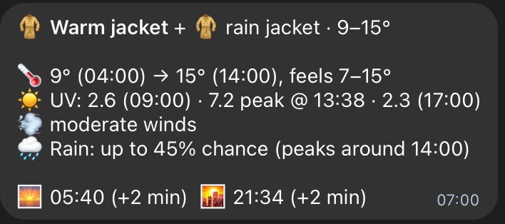
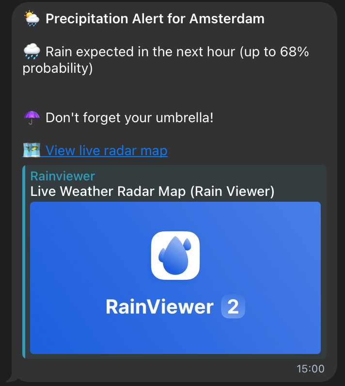

# Amsterdam Weather Bot

A Telegram bot ([@DailyUVIndexBot](https://t.me/DailyUVIndexBot)) that sends a short, plain-language weather briefing for Amsterdam each morning — what to wear, UV outlook, wind, rain — and pings you again if rain is on the way.

  
  

